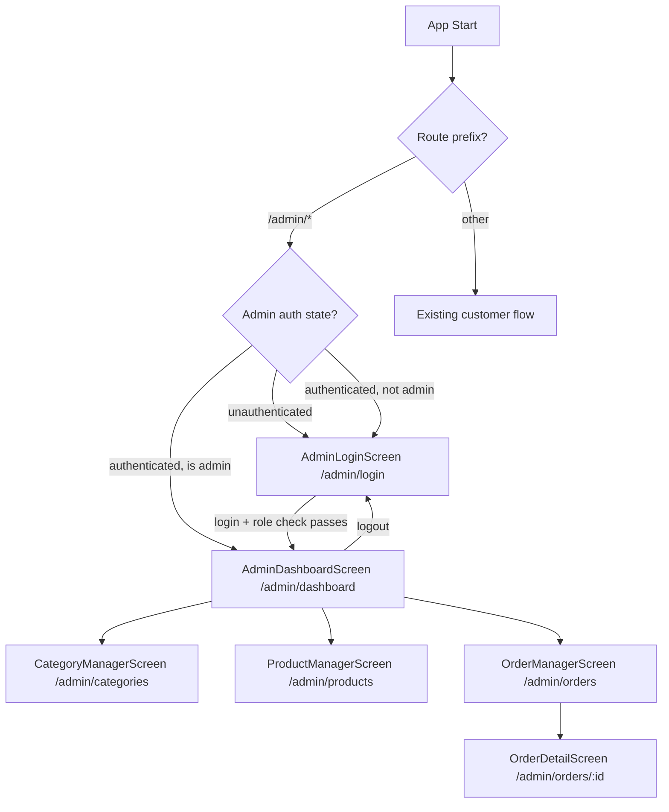

# Design Document: Admin Panel

## Overview

The Admin Panel is a role-gated section added to the existing Flutter Android grocery delivery app. It shares the same Firebase Auth backend but adds a Firestore `admins` collection to distinguish admin users from regular customers. Admins access a parallel set of screens under the `/admin/*` route prefix to manage categories, products, and orders, and to seed test data.

The admin and customer flows are fully isolated at the routing layer. No existing customer screen, provider, or service is modified — the admin panel is purely additive.

### Key Design Decisions

- **Role check via Firestore `admins` collection**: After Firebase Auth login, `AdminAuthService` queries `admins/{uid}` to confirm admin status. This keeps role data server-side and avoids embedding roles in custom claims (which would require Cloud Functions).
- **Separate admin router notifier**: A dedicated `AdminRouterNotifier` handles `/admin/*` redirect guards, leaving the existing `RouterNotifier` and customer guards untouched.
- **Admin services are write-capable wrappers**: `AdminProductService` and `AdminOrderService` extend the read-only contracts of the existing services with write operations. The existing `ProductService` and `OrderService` remain read-only for customers.
- **Real-time order stream**: `AdminOrderService` exposes a `Stream<List<AdminOrder>>` so the Order Manager updates live without polling.
- **SeedService uses batch writes**: Firestore batch writes ensure seed data is written atomically — either all documents land or none do.
- **`offerPrice` and `quantity` are nullable additions to `Item`**: Existing `Item.fromFirestore` is extended to read these optional fields without breaking existing customer screens.

---

## Architecture

The admin panel slots into the existing layered architecture as a parallel track:

```
┌─────────────────────────────────────────────────────────────────┐
│                        UI Layer                                 │
│  Customer Screens          │  Admin Screens                     │
│  (unchanged)               │  AdminLoginScreen                  │
│                            │  AdminDashboardScreen              │
│                            │  CategoryManagerScreen             │
│                            │  ProductManagerScreen              │
│                            │  OrderManagerScreen                │
│                            │  OrderDetailScreen                 │
├─────────────────────────────────────────────────────────────────┤
│                      State Layer (Riverpod)                     │
│  Existing providers        │  adminAuthStateProvider            │
│  (unchanged)               │  adminRoleProvider                 │
│                            │  adminCategoriesProvider           │
│                            │  adminProductsProvider             │
│                            │  adminOrdersProvider               │
│                            │  seedServiceProvider               │
├─────────────────────────────────────────────────────────────────┤
│                      Service Layer                              │
│  AuthService               │  AdminAuthService                  │
│  ProductService            │  AdminProductService               │
│  OrderService              │  AdminOrderService                 │
│  LocationService           │  SeedService                       │
│  PaymentService            │                                    │
├─────────────────────────────────────────────────────────────────┤
│                      External                                   │
│         Firebase Auth  ·  Cloud Firestore                       │
└─────────────────────────────────────────────────────────────────┘
```

### Navigation Flow



### Route Table

| Path | Screen | Guard |
|---|---|---|
| `/admin/login` | AdminLoginScreen | none (public) |
| `/admin/dashboard` | AdminDashboardScreen | admin auth required |
| `/admin/categories` | CategoryManagerScreen | admin auth required |
| `/admin/products` | ProductManagerScreen | admin auth required |
| `/admin/orders` | OrderManagerScreen | admin auth required |
| `/admin/orders/:id` | OrderDetailScreen | admin auth required |

All existing customer routes (`/auth`, `/location`, `/home`, `/item/:id`, `/cart`, `/checkout`, `/confirmation`) remain unchanged.

---

## Components and Interfaces

### Services

#### AdminAuthService
```dart
abstract class AdminAuthService {
  Future<void> signIn(String email, String password);
  Future<bool> isAdmin(String uid); // queries admins/{uid}
  Future<void> signOut();
  User? get currentUser;
  Stream<User?> get authStateChanges;
}
```

`FirebaseAdminAuthService` implements this by delegating sign-in/out to `FirebaseAuth` and performing a `firestore.collection('admins').doc(uid).get()` existence check for `isAdmin`.

#### AdminProductService
```dart
abstract class AdminProductService {
  Future<List<Category>> getCategories();
  Future<List<Item>> getProducts();
  Future<void> addCategory(Category category);
  Future<void> updateCategory(Category category);
  Future<void> addProduct(Item product);
  Future<void> updateProduct(Item product);
}
```

#### AdminOrderService
```dart
abstract class AdminOrderService {
  Stream<List<AdminOrder>> watchPendingOrders(); // status == "confirmed", desc createdAt
  Future<AdminOrder> getOrderById(String orderId);
}
```

#### SeedService
```dart
abstract class SeedService {
  Future<SeedResult> seedData(); // returns counts of seeded categories/products
}

class SeedResult {
  final int categoriesSeeded;
  final int productsSeeded;
}
```

`FirestoreSeedService` uses a single `WriteBatch` to write ≥3 categories and ≥6 products atomically.

### Riverpod Providers

| Provider | Type | Purpose |
|---|---|---|
| `adminAuthServiceProvider` | `Provider<AdminAuthService>` | Admin Firebase Auth + role check |
| `adminAuthStateProvider` | `StreamProvider<User?>` | Live admin auth stream |
| `adminRoleProvider` | `FutureProvider<bool>` | Is current user an admin? |
| `adminProductServiceProvider` | `Provider<AdminProductService>` | Firestore category/product writes |
| `adminOrderServiceProvider` | `Provider<AdminOrderService>` | Firestore order stream |
| `seedServiceProvider` | `Provider<SeedService>` | Seed data utility |
| `adminCategoriesProvider` | `FutureProvider<List<Category>>` | All categories for admin UI |
| `adminProductsProvider` | `FutureProvider<List<Item>>` | All products for admin UI |
| `adminOrdersProvider` | `StreamProvider<List<AdminOrder>>` | Live pending orders stream |

### AdminRouterNotifier

A new `AdminRouterNotifier extends ChangeNotifier` listens to `adminAuthStateProvider` and `adminRoleProvider`. Its `redirect` method:
- Allows `/admin/login` through unconditionally.
- Redirects any other `/admin/*` path to `/admin/login` if the user is unauthenticated or not an admin.

This notifier is wired into the existing `GoRouter` as an additional `refreshListenable` alongside the existing `RouterNotifier`, and the admin routes are appended to the existing routes list.

### Screen Responsibilities

| Screen | Key responsibilities |
|---|---|
| `AdminLoginScreen` | Email/password form → `AdminAuthService.signIn` → `isAdmin` check → navigate or show error |
| `AdminDashboardScreen` | Navigation tiles to sub-sections + Seed Data button + logout |
| `CategoryManagerScreen` | List categories, add/edit form with validation, Firestore write via `AdminProductService` |
| `ProductManagerScreen` | List products, add/edit form (name, desc, imageUrl, category dropdown, price, offerPrice, quantity, inStock), Firestore write |
| `OrderManagerScreen` | Real-time list of confirmed orders via `adminOrdersProvider` stream |
| `OrderDetailScreen` | Full order detail view for a single `AdminOrder` |

---

## Data Models

### Firestore Collections

#### `admins` collection (new)
```
admins/{uid}
  email: String   // informational only; role is determined by document existence
```
A document's existence at `admins/{uid}` is the sole signal that the user is an admin.

#### `products` collection (updated fields)
```
products/{productId}
  name: String
  description: String
  imageUrl: String
  price: double
  offerPrice: double?   // NEW — null means no active offer
  quantity: int         // NEW — stock quantity
  categoryId: String
  inStock: bool
```

Existing fields are unchanged. `offerPrice` and `quantity` are optional reads in `Item.fromFirestore` so existing customer screens continue to work without modification.

#### `categories` collection (unchanged)
```
categories/{categoryId}
  name: String
  imageUrl: String
  sortOrder: int
```

#### `orders` collection (unchanged schema, new read pattern)
```
orders/{orderId}
  userId: String
  deliveryLocation: String
  items: List<OrderItem>
  totalAmount: double
  paymentMethod: String
  status: String
  createdAt: Timestamp
```

### Dart Models

#### Updated `Item` model
```dart
class Item {
  final String id;
  final String name;
  final String description;
  final String imageUrl;
  final double price;
  final double? offerPrice;   // null = no offer
  final int quantity;         // stock count
  final String categoryId;
  final bool inStock;

  // effectivePrice returns offerPrice if set, otherwise price
  double get effectivePrice => offerPrice ?? price;

  factory Item.fromFirestore(DocumentSnapshot doc) {
    final data = doc.data() as Map<String, dynamic>;
    return Item(
      id: doc.id,
      name: data['name'] as String,
      description: data['description'] as String,
      imageUrl: data['imageUrl'] as String,
      price: (data['price'] as num).toDouble(),
      offerPrice: data['offerPrice'] != null
          ? (data['offerPrice'] as num).toDouble()
          : null,
      quantity: (data['quantity'] as num?)?.toInt() ?? 0,
      categoryId: data['categoryId'] as String,
      inStock: data['inStock'] as bool,
    );
  }

  Map<String, dynamic> toFirestore() => {
    'name': name,
    'description': description,
    'imageUrl': imageUrl,
    'price': price,
    if (offerPrice != null) 'offerPrice': offerPrice,
    'quantity': quantity,
    'categoryId': categoryId,
    'inStock': inStock,
  };
}
```

#### `AdminOrder` model (new)
```dart
class AdminOrder {
  final String id;
  final String userId;
  final String deliveryLocation;
  final List<AdminOrderItem> items;
  final double totalAmount;
  final String paymentMethod;
  final String status;
  final DateTime createdAt;

  factory AdminOrder.fromFirestore(DocumentSnapshot doc) { ... }
}

class AdminOrderItem {
  final String productId;
  final String name;
  final double unitPrice;
  final int quantity;
  final double lineTotal;
}
```

#### `AdminState` model (new)
```dart
// Represents the admin authentication + role state used by AdminRouterNotifier
enum AdminAuthStatus { unknown, unauthenticated, authenticating, authenticated, notAdmin }

class AdminState {
  final AdminAuthStatus status;
  final String? errorMessage;
  final User? user;
}
```

#### `SeedResult` model (new)
```dart
class SeedResult {
  final int categoriesSeeded;
  final int productsSeeded;
}
```

---
## Correctness Properties

*A property is a characteristic or behavior that should hold true across all valid executions of a system — essentially, a formal statement about what the system should do. Properties serve as the bridge between human-readable specifications and machine-verifiable correctness guarantees.*

### Property 1: Admin redirect for unauthenticated and non-admin users

*For any* `/admin/*` route path, if the current user is either unauthenticated or authenticated but not present in the `admins` Firestore collection, the router redirect function should return `/admin/login`.

**Validates: Requirements 1.7, 1.8, 7.3**

---

### Property 2: Role check determines navigation outcome

*For any* Firebase Auth user, after a successful sign-in, if `isAdmin(uid)` returns `true` the resulting navigation target should be `/admin/dashboard`, and if `isAdmin(uid)` returns `false` the user should be signed out and the error message "Access denied: not an admin account." should be set.

**Validates: Requirements 1.2, 1.3, 1.4**

---

### Property 3: Auth error prevents Role_Checker invocation

*For any* credential pair that causes Firebase Auth to throw an error, the `isAdmin` method should never be called — the call count of `isAdmin` should remain zero.

**Validates: Requirements 1.5**

---

### Property 4: Category list is ordered by sortOrder

*For any* list of categories returned by `AdminProductService.getCategories`, the list should be sorted in ascending order by `sortOrder` — that is, for every adjacent pair `(a, b)` in the list, `a.sortOrder <= b.sortOrder`.

**Validates: Requirements 3.1, 3.2**

---

### Property 5: Valid category add appears in list

*For any* valid `Category` object (all required fields non-empty), after calling `AdminProductService.addCategory`, a subsequent call to `getCategories` should return a list that contains a category with the same name, imageUrl, and sortOrder.

**Validates: Requirements 3.4**

---

### Property 6: Invalid category form does not write to Firestore

*For any* category form submission where at least one required field (name, imageUrl, sortOrder) is empty or null, the `AdminProductService.addCategory` method should not be called — the Firestore write count should remain zero.

**Validates: Requirements 3.5**

---

### Property 7: Edit form pre-populates with current entity values

*For any* existing `Category` or `Item` selected for editing, the initial values of the edit form fields should equal the corresponding fields of the selected entity.

**Validates: Requirements 3.6, 4.6**

---

### Property 8: Valid category edit updates Firestore document

*For any* existing category and any valid updated field values, after calling `AdminProductService.updateCategory`, a subsequent call to `getCategories` should return a list containing a category with the updated values at the same document ID.

**Validates: Requirements 3.7**

---

### Property 9: Firestore error triggers error display

*For any* admin screen operation (category read/write, product read/write, order stream) where the Firestore call throws an exception, the resulting UI state should contain a non-null, non-empty error message.

**Validates: Requirements 3.8, 4.9, 5.5**

---

### Property 10: Product list displays required fields for every product

*For any* list of products returned by `AdminProductService.getProducts`, every rendered product row should contain the product's name, price, and the name of its associated category.

**Validates: Requirements 4.1**

---

### Property 11: Valid product add appears in list

*For any* valid `Item` object (all required fields filled, numeric fields are valid numbers), after calling `AdminProductService.addProduct`, a subsequent call to `getProducts` should return a list that contains a product with the same name, price, and categoryId.

**Validates: Requirements 4.4**

---

### Property 12: Invalid product form does not write to Firestore

*For any* product form submission where at least one required field is empty or a numeric field contains a non-numeric value, the `AdminProductService.addProduct` method should not be called.

**Validates: Requirements 4.5**

---

### Property 13: Valid product edit updates Firestore document

*For any* existing product and any valid updated field values, after calling `AdminProductService.updateProduct`, a subsequent call to `getProducts` should return a list containing a product with the updated values at the same document ID.

**Validates: Requirements 4.7**

---

### Property 14: offerPrice is stored alongside regular price

*For any* `Item` where `offerPrice` is non-null, the Firestore document produced by `Item.toFirestore()` should contain both a `price` field and an `offerPrice` field, and `offerPrice` should be less than or equal to `price`.

**Validates: Requirements 4.8**

---

### Property 15: Order list contains only confirmed orders in descending createdAt order

*For any* snapshot of the `orders` Firestore collection, the list returned by `AdminOrderService.watchPendingOrders` should contain only orders where `status == "confirmed"`, and for every adjacent pair `(a, b)` in the list, `a.createdAt >= b.createdAt`.

**Validates: Requirements 5.1, 5.2**

---

### Property 16: Order row displays all required fields

*For any* `AdminOrder`, the rendered order list row should contain the order ID, userId, totalAmount, paymentMethod, and createdAt timestamp.

**Validates: Requirements 5.3**

---

### Property 17: Seed result meets minimum count requirements

*For any* successful invocation of `SeedService.seedData`, the returned `SeedResult` should satisfy `categoriesSeeded >= 3` and `productsSeeded >= 6`.

**Validates: Requirements 6.2, 6.3**

---

### Property 18: Admin user can access customer routes without redirect

*For any* customer route path (e.g., `/home`, `/cart`, `/checkout`) and any authenticated admin user, the customer router's redirect function should return `null` — no redirect should occur.

**Validates: Requirements 7.4**

---

### Property 19: effectivePrice returns offerPrice when set, otherwise regular price

*For any* `Item`, `item.effectivePrice` should equal `item.offerPrice` when `offerPrice` is non-null, and should equal `item.price` when `offerPrice` is null.

**Validates: Requirements 4.8**

---

## Error Handling

| Scenario | Handling |
|---|---|
| Firebase Auth sign-in failure | Catch `FirebaseAuthException`, map code to user-friendly message, display in form, do not invoke role check |
| Role check: user not in `admins` | Sign out via `AdminAuthService.signOut`, set `AdminState.status = notAdmin`, display "Access denied: not an admin account." |
| Firestore read error (categories/products/orders) | Set provider error state, display error banner with retry button that invalidates the provider |
| Firestore write error (add/edit category or product) | Catch exception in service, rethrow; notifier catches and sets error message in state |
| Seed batch write failure | Catch exception in `SeedService.seedData`, return error via `Future.error`; dashboard notifier displays error snackbar |
| Admin route accessed without auth | `AdminRouterNotifier.redirect` returns `/admin/login` before screen builds |
| Network unavailable | Firebase SDK throws; handled by the same Firestore error path above |

---

## Testing Strategy

### Dual Testing Approach

Both unit tests and property-based tests are required. They are complementary:
- Unit tests cover specific examples, integration points, and edge cases (empty order list, loading states, UI presence checks).
- Property-based tests verify universal invariants across randomly generated inputs.

### Property-Based Testing Library

Use **`fast_check`** (Dart port of fast-check) or **`glados`** (idiomatic Dart PBT library). `glados` is preferred as it integrates naturally with `flutter_test` and supports custom `Arbitrary` generators.

```yaml
dev_dependencies:
  glados: ^0.6.0
```

Each property test must run a minimum of **100 iterations**.

### Property Test Tag Format

Each property-based test must include a comment referencing the design property:

```dart
// Feature: admin-panel, Property 4: Category list is ordered by sortOrder
```

### Property Test Mapping

| Design Property | Test description | Pattern |
|---|---|---|
| P1: Admin redirect | Generate random admin route paths + unauthenticated/non-admin state → redirect == /admin/login | Invariant |
| P2: Role check navigation | Generate random UIDs, mock isAdmin result → verify navigation target | Metamorphic |
| P3: Auth error no role check | Generate random bad credentials → isAdmin call count == 0 | Error condition |
| P4: Category sort order | Generate random category lists → sorted by sortOrder | Invariant |
| P5: Category add round-trip | Generate random valid categories → add → getCategories contains it | Round-trip |
| P6: Invalid category no write | Generate forms with ≥1 empty field → addCategory not called | Error condition |
| P7: Edit form pre-population | Generate random entities → select for edit → form values match entity | Invariant |
| P8: Category edit round-trip | Generate random edits → updateCategory → getCategories reflects update | Round-trip |
| P9: Firestore error → error state | Generate any operation + mock Firestore error → error message non-null | Error condition |
| P10: Product row fields | Generate random products → render row → contains name, price, category | Invariant |
| P11: Product add round-trip | Generate random valid products → add → getProducts contains it | Round-trip |
| P12: Invalid product no write | Generate forms with invalid fields → addProduct not called | Error condition |
| P13: Product edit round-trip | Generate random edits → updateProduct → getProducts reflects update | Round-trip |
| P14: offerPrice stored | Generate items with non-null offerPrice → toFirestore contains both fields | Invariant |
| P15: Order list filter + sort | Generate mixed-status orders → watchPendingOrders → only confirmed, desc order | Invariant |
| P16: Order row fields | Generate random AdminOrders → render row → contains all required fields | Invariant |
| P17: Seed minimum counts | Run seedData → SeedResult.categoriesSeeded >= 3 && productsSeeded >= 6 | Invariant |
| P18: Admin on customer routes | Generate customer route paths + admin user → redirect == null | Invariant |
| P19: effectivePrice | Generate items with/without offerPrice → effectivePrice == offerPrice ?? price | Invariant |

### Unit Test Coverage

Unit tests should cover:
- `AdminLoginScreen` renders email and password fields (example — Req 1.1)
- `AdminDashboardScreen` renders three navigation tiles and logout button (example — Req 2.1, 2.3)
- `AdminDashboardScreen` renders Seed Data button when authenticated (example — Req 6.1)
- Loading indicator shown during auth/role-check (example — Req 1.6)
- Loading indicator shown during seed write (example — Req 6.5)
- Empty state message shown when order list is empty (edge case — Req 5.6)
- Seed Data button disabled during write (example — Req 6.5)
- `AdminRouterNotifier` allows `/admin/login` through without redirect (edge case — Req 1.7)
