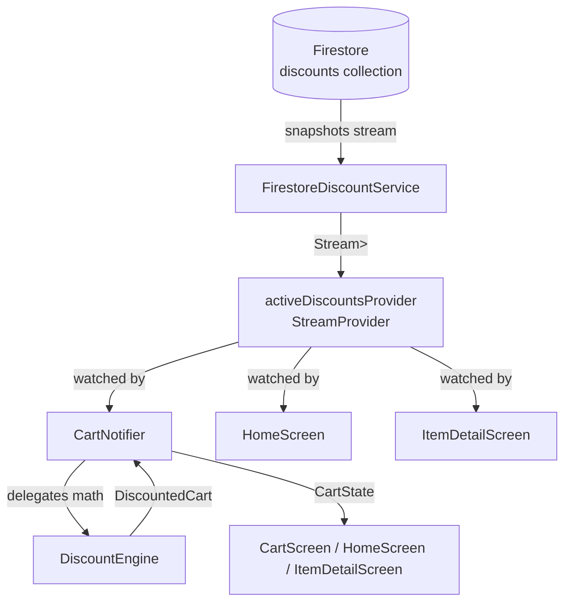
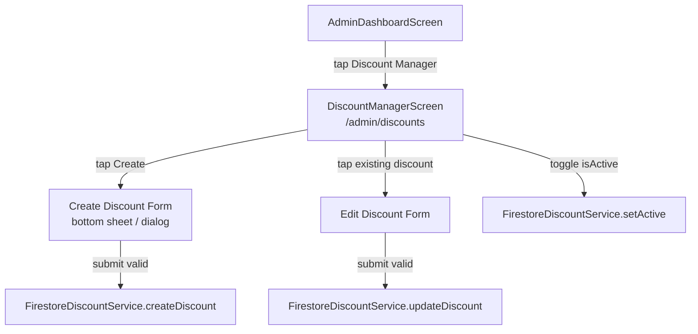

# Design Document: Custom Discounts

## Overview

The Custom Discounts feature adds a first-class promotions system to the Flutter grocery delivery app. It replaces the ad-hoc `offer` map embedded in `Item` documents with a standalone, Firestore-backed `Discount` entity that can be created, edited, and deactivated independently of product documents.

The feature is purely additive: no existing customer screen, provider, or service is deleted. The existing `Item.offer` field is left in place for backward compatibility; the new `DiscountEngine` supersedes it for cart calculations.

### Key Design Decisions

- **Standalone `discounts` Firestore collection**: Decouples promotion rules from product documents, enabling admins to run and pause promotions without touching product data.
- **`DiscountEngine` is a pure computation class**: No Firestore dependency — takes a `List<Discount>` and a `List<CartItem>` and returns computed totals. This makes it trivially unit-testable and property-testable.
- **Best-discount-wins per line item**: When multiple active discounts match a cart item (e.g. a product-scoped and a category-scoped discount), the engine picks the one that produces the lowest line total. This is deterministic and customer-friendly.
- **`CartNotifier` consumes `activeDiscountsProvider`**: The notifier watches the stream of active discounts and delegates all math to `DiscountEngine`, keeping the notifier thin.
- **`CartState` gains `savings` and per-item `discountedLineTotals`**: Computed fields are stored in state so the UI can read them without re-running the engine.
- **`DiscountBadge` is a shared widget**: Used identically on home screen product cards, item detail screen, and cart item rows — single source of truth for badge rendering logic.
- **Admin service follows existing abstract + Firebase implementation pattern**: `DiscountService` abstract class with `FirestoreDiscountService` implementation, matching `AdminProductService` / `FirestoreAdminProductService`.

---

## Architecture

```
┌──────────────────────────────────────────────────────────────────────┐
│                            UI Layer                                  │
│  Customer Screens                  │  Admin Screens                  │
│  HomeScreen (badge overlay)        │  AdminDashboardScreen (+ tile)  │
│  ItemDetailScreen (badge + price)  │  DiscountManagerScreen          │
│  CartScreen (badge + bill summary) │                                 │
│  DiscountBadge widget              │                                 │
├──────────────────────────────────────────────────────────────────────┤
│                       State Layer (Riverpod)                         │
│  cartProvider (CartNotifier)       │  allDiscountsProvider           │
│  activeDiscountsProvider           │  discountServiceProvider        │
├──────────────────────────────────────────────────────────────────────┤
│                        Service / Engine Layer                        │
│  DiscountService (abstract)        │  DiscountEngine (pure)          │
│  FirestoreDiscountService          │                                 │
├──────────────────────────────────────────────────────────────────────┤
│                           External                                   │
│              Firebase Auth  ·  Cloud Firestore                       │
└──────────────────────────────────────────────────────────────────────┘
```

### Data Flow



### Navigation Flow



### Route Table

| Path | Screen | Guard |
|---|---|---|
| `/admin/discounts` | DiscountManagerScreen | admin auth required |

All existing routes are unchanged.

---

## Components and Interfaces

### DiscountService

```dart
abstract class DiscountService {
  /// Real-time stream of active discounts for customer-facing UI and cart engine.
  Stream<List<Discount>> watchActiveDiscounts();

  /// Real-time stream of all discounts (active + inactive) for admin management.
  Stream<List<Discount>> watchAllDiscounts();

  /// Creates a new discount document. Sets isActive=true, createdAt=serverTimestamp.
  Future<void> createDiscount(Discount discount);

  /// Updates mutable fields of an existing discount document.
  Future<void> updateDiscount(Discount discount);

  /// Sets the isActive field of a discount document.
  Future<void> setActive(String discountId, bool isActive);
}
```

`FirestoreDiscountService` implements this by querying `firestore.collection('discounts')`.

### DiscountEngine

```dart
/// Pure computation class — no Firestore dependency.
class DiscountEngine {
  const DiscountEngine();

  /// Returns the discounted line total for a single cart item.
  /// Selects the best (lowest-total) matching discount.
  double computeLineTotal(CartItem cartItem, List<Discount> activeDiscounts);

  /// Returns the best matching discount for an item, or null if none applies.
  Discount? bestDiscount(Item item, List<Discount> activeDiscounts);

  /// Computes a full DiscountedCart from a list of cart items and active discounts.
  DiscountedCart compute(List<CartItem> items, List<Discount> activeDiscounts);
}

/// Result of DiscountEngine.compute — immutable value object.
class DiscountedCart {
  final List<DiscountedLine> lines;
  final double subtotal;      // sum of undiscounted line totals
  final double totalSavings;  // subtotal - grandTotal
  final double grandTotal;    // sum of discounted line totals
}

class DiscountedLine {
  final CartItem cartItem;
  final Discount? appliedDiscount;  // null if no discount applies
  final double originalLineTotal;
  final double discountedLineTotal;
}
```

### CartNotifier (extended)

```dart
// CartNotifier watches activeDiscountsProvider and recomputes on every change.
// New public surface:
class CartNotifier extends StateNotifier<CartState> {
  // existing methods unchanged: addItem, incrementItem, decrementItem, clearCart, quantityOf

  // replaces the old calculateItemTotal / total / totalSavings helpers:
  DiscountedCart get discountedCart; // delegates to DiscountEngine
}
```

### CartState (extended)

```dart
class CartState {
  final List<CartItem> items;
  final DiscountedCart? discountedCart; // null until activeDiscountsProvider resolves

  // convenience getters
  double get grandTotal => discountedCart?.grandTotal ?? _rawTotal;
  double get totalSavings => discountedCart?.totalSavings ?? 0;
  bool get isEmpty => items.isEmpty;
}
```

### DiscountBadge widget

```dart
class DiscountBadge extends StatelessWidget {
  final Discount discount;
  const DiscountBadge({super.key, required this.discount});

  // Renders badge text:
  //   percentage → "X% OFF"
  //   bogo       → "BUY B GET F FREE"
  //   bulk       → "SAVE D% on M+"
}
```

### Riverpod Providers

| Provider | Type | Purpose |
|---|---|---|
| `discountServiceProvider` | `Provider<DiscountService>` | Singleton FirestoreDiscountService |
| `activeDiscountsProvider` | `StreamProvider<List<Discount>>` | Live stream of isActive==true discounts |
| `allDiscountsProvider` | `StreamProvider<List<Discount>>` | Live stream of all discounts (admin) |

### DiscountManagerScreen

Responsibilities:
- Watches `allDiscountsProvider` and renders a list of discount tiles.
- Each tile shows: name, type badge, scope + target name, isActive toggle.
- FAB opens a Create Discount bottom sheet.
- Tapping a tile opens an Edit Discount bottom sheet pre-populated with current values.
- Toggle calls `DiscountService.setActive`; on Firestore error, reverts toggle and shows snackbar.
- Form validates all fields before calling `DiscountService.createDiscount` / `updateDiscount`.

---

## Data Models

### Firestore Schema

#### `discounts` collection (new)

```
discounts/{discountId}
  id:              String        // document ID
  name:            String        // human-readable label, e.g. "Summer 10% Off"
  type:            String        // "percentage" | "bogo" | "bulk"
  scope:           String        // "product" | "category"
  targetId:        String        // product ID or category ID
  isActive:        bool
  createdAt:       Timestamp

  // type == "percentage"
  value:           double        // 0 < value <= 100

  // type == "bogo"
  buyQty:          int           // >= 1
  freeQty:         int           // >= 1

  // type == "bulk"
  minQty:          int           // >= 2
  discountPercent: double        // 0 < discountPercent <= 100
```

Type-specific fields are stored at the top level of the document (not nested). Fields irrelevant to the discount type are absent from the document.

### Dart Model

```dart
enum DiscountType { percentage, bogo, bulk }
enum DiscountScope { product, category }

class Discount {
  final String id;
  final String name;
  final DiscountType type;
  final DiscountScope scope;
  final String targetId;
  final bool isActive;
  final DateTime createdAt;

  // percentage
  final double? value;

  // bogo
  final int? buyQty;
  final int? freeQty;

  // bulk
  final int? minQty;
  final double? discountPercent;

  const Discount({
    required this.id,
    required this.name,
    required this.type,
    required this.scope,
    required this.targetId,
    required this.isActive,
    required this.createdAt,
    this.value,
    this.buyQty,
    this.freeQty,
    this.minQty,
    this.discountPercent,
  });

  factory Discount.fromFirestore(DocumentSnapshot doc) {
    final data = doc.data() as Map<String, dynamic>;
    return Discount(
      id: doc.id,
      name: data['name'] as String,
      type: DiscountType.values.byName(data['type'] as String),
      scope: DiscountScope.values.byName(data['scope'] as String),
      targetId: data['targetId'] as String,
      isActive: data['isActive'] as bool,
      createdAt: (data['createdAt'] as Timestamp).toDate(),
      value: (data['value'] as num?)?.toDouble(),
      buyQty: (data['buyQty'] as num?)?.toInt(),
      freeQty: (data['freeQty'] as num?)?.toInt(),
      minQty: (data['minQty'] as num?)?.toInt(),
      discountPercent: (data['discountPercent'] as num?)?.toDouble(),
    );
  }

  Map<String, dynamic> toFirestore() => {
    'name': name,
    'type': type.name,
    'scope': scope.name,
    'targetId': targetId,
    'isActive': isActive,
    'createdAt': Timestamp.fromDate(createdAt),
    if (value != null) 'value': value,
    if (buyQty != null) 'buyQty': buyQty,
    if (freeQty != null) 'freeQty': freeQty,
    if (minQty != null) 'minQty': minQty,
    if (discountPercent != null) 'discountPercent': discountPercent,
  };
}
```

### DiscountEngine Computation Rules

| Discount type | Condition | Line total formula |
|---|---|---|
| `percentage` | always | `P × (1 − V/100) × Q` |
| `bogo` | always | `payable × P` where `payable = (Q ÷ (B+F)) × B + (Q mod (B+F))` |
| `bulk` | `Q >= minQty` | `P × (1 − D/100) × Q` |
| `bulk` | `Q < minQty` | `P × Q` (no discount) |
| none | no match | `P × Q` |

When multiple discounts match an item, the engine selects the one producing the lowest line total (best-for-customer).

---

## Correctness Properties

*A property is a characteristic or behavior that should hold true across all valid executions of a system — essentially, a formal statement about what the system should do. Properties serve as the bridge between human-readable specifications and machine-verifiable correctness guarantees.*

### Property 1: Serialization round-trip

*For any* valid `Discount` object (of any type — percentage, bogo, or bulk), serializing it via `toFirestore()` and then deserializing the resulting map via `Discount.fromFirestore` should produce a `Discount` with identical values for all fields (`id`, `name`, `type`, `scope`, `targetId`, `isActive`, `createdAt`, and all type-specific fields).

**Validates: Requirements 1.1, 1.2, 1.3, 1.4, 10.3**

---

### Property 2: Active discount filter correctness

*For any* collection of `Discount` documents with mixed `isActive` values, `watchActiveDiscounts()` should emit only discounts where `isActive == true`, and `watchAllDiscounts()` should emit all discounts regardless of `isActive`.

**Validates: Requirements 1.5, 1.6**

---

### Property 3: Invalid form does not write to Firestore

*For any* discount form submission where at least one required field is empty, null, or contains an out-of-range numeric value (e.g. `value <= 0`, `value > 100`, `buyQty < 1`, `minQty < 2`), neither `DiscountService.createDiscount` nor `DiscountService.updateDiscount` should be called — the Firestore write count should remain zero.

**Validates: Requirements 2.6, 3.4**

---

### Property 4: Firestore error produces non-null error message

*For any* `DiscountService` operation (create, update, setActive) where Firestore throws an exception, the resulting UI state should contain a non-null, non-empty error message string.

**Validates: Requirements 2.8, 3.5, 4.5**

---

### Property 5: Discount list tile renders all required fields

*For any* `Discount` object, the rendered list tile in `DiscountManagerScreen` should contain the discount's name, type label, scope label, and a toggle widget whose value matches `discount.isActive`.

**Validates: Requirements 3.1, 4.1**

---

### Property 6: Edit form pre-populates with current discount values

*For any* existing `Discount` selected for editing, the initial values of all edit form fields should equal the corresponding fields of the selected `Discount` object.

**Validates: Requirements 3.2**

---

### Property 7: Toggle isActive round-trip

*For any* `Discount`, toggling `isActive` from `true` to `false` and then back to `true` via `DiscountService.setActive` should result in the discount having `isActive == true` — the same state as the original.

**Validates: Requirements 4.2, 4.3**

---

### Property 8: Best discount wins per line item

*For any* cart item and any list of active discounts where multiple discounts match the item (by product ID or category ID), `DiscountEngine.computeLineTotal` should return a value less than or equal to the line total produced by any individual matching discount applied alone.

**Validates: Requirements 5.2**

---

### Property 9: Percentage discount formula

*For any* item with unit price `P`, cart quantity `Q`, and a percentage discount with value `V` (where `0 < V <= 100`), `DiscountEngine.computeLineTotal` should return exactly `P × (1 − V/100) × Q`.

**Validates: Requirements 5.3**

---

### Property 10: BOGO discount formula

*For any* item with unit price `P`, cart quantity `Q`, and a BOGO discount with `buyQty` B and `freeQty` F, `DiscountEngine.computeLineTotal` should return `payable × P` where `payable = (Q ~/ (B + F)) * B + (Q % (B + F))`.

**Validates: Requirements 5.4**

---

### Property 11: Bulk discount threshold behavior

*For any* item with unit price `P`, cart quantity `Q`, and a bulk discount with `minQty` M and `discountPercent` D: when `Q >= M` the line total should be `P × (1 − D/100) × Q`; when `Q < M` the line total should be `P × Q` (no discount applied).

**Validates: Requirements 5.5, 5.6**

---

### Property 12: Savings invariant

*For any* cart state with a computed `DiscountedCart`, `totalSavings` should equal the sum over all lines of `(cartItem.item.price × cartItem.quantity) − discountedLineTotal`, and `grandTotal` should equal `subtotal − totalSavings`.

**Validates: Requirements 5.7, 8.4**

---

### Property 13: Discount scope matching

*For any* active discount with `scope == "product"` and `targetId` T, `DiscountEngine.bestDiscount` should return that discount only for items where `item.id == T`, and should return `null` for items where `item.id != T`. For any active discount with `scope == "category"` and `targetId` T, `bestDiscount` should return that discount for all items where `item.categoryId == T`, and `null` for items where `item.categoryId != T`.

**Validates: Requirements 5.9, 5.10**

---

### Property 14: Discount badge text format

*For any* `Discount`, the text rendered by `DiscountBadge` should match the format for its type: percentage → `"${value.toInt()}% OFF"`, bogo → `"BUY $buyQty GET $freeQty FREE"`, bulk → `"SAVE ${discountPercent.toInt()}% on $minQty+"`.

**Validates: Requirements 6.3, 6.4, 6.5**

---

### Property 15: /admin/discounts route guard

*For any* request to `/admin/discounts` where the current user is either unauthenticated or authenticated but not present in the `admins` Firestore collection, `AdminRouterNotifier.redirect` should return `/admin/login`.

**Validates: Requirements 9.3**

---

## Error Handling

| Scenario | Handling |
|---|---|
| Firestore `watchActiveDiscounts` stream error | `activeDiscountsProvider` enters error state; `CartNotifier` falls back to zero discounts (no crash); customer UI shows items at full price |
| Firestore `watchAllDiscounts` stream error | `allDiscountsProvider` enters error state; `DiscountManagerScreen` shows error banner with retry (invalidates provider) |
| `createDiscount` Firestore write error | `DiscountManagerScreen` catches exception, shows snackbar with error message and retry option; form remains open |
| `updateDiscount` Firestore write error | Same as createDiscount |
| `setActive` Firestore write error | Toggle is optimistically updated; on error, toggle is reverted to previous state and snackbar is shown |
| Form validation failure (empty/out-of-range fields) | Field-level inline error text shown; write not attempted |
| `DiscountEngine` receives empty discount list | Returns `DiscountedCart` with all lines at full price and `totalSavings == 0` |
| `Discount.fromFirestore` encounters unknown type/scope string | Throws `ArgumentError`; caught by stream error handler above |
| Cart item has no matching discount | `bestDiscount` returns `null`; line total computed as `price × quantity` |

---

## Testing Strategy

### Dual Testing Approach

Both unit tests and property-based tests are required and complementary:
- Unit tests cover specific examples, integration points, and edge cases.
- Property-based tests verify universal invariants across randomly generated inputs.

### Property-Based Testing Library

Use **`glados`** — the idiomatic Dart PBT library that integrates naturally with `flutter_test` and supports custom `Arbitrary` generators.

```yaml
dev_dependencies:
  glados: ^0.6.0
```

Each property test must run a minimum of **100 iterations**.

### Property Test Tag Format

Each property-based test must include a comment referencing the design property:

```dart
// Feature: custom-discounts, Property 1: Serialization round-trip
```

### Property Test Mapping

| Design Property | Test description | Pattern |
|---|---|---|
| P1: Serialization round-trip | Generate random valid Discounts of all three types → toFirestore → fromFirestore → field equality | Round-trip |
| P2: Active discount filter | Generate random Discount lists with mixed isActive → watchActiveDiscounts emits only isActive==true | Invariant |
| P3: Invalid form no write | Generate forms with ≥1 invalid field → createDiscount/updateDiscount not called | Error condition |
| P4: Firestore error → error message | Mock Firestore to throw on any write → UI state error message non-null | Error condition |
| P5: List tile renders required fields | Generate random Discounts → render tile → contains name, type, scope, toggle | Invariant |
| P6: Edit form pre-population | Generate random Discounts → open edit form → form field values match discount fields | Invariant |
| P7: Toggle round-trip | Generate random Discounts → setActive(false) → setActive(true) → isActive==true | Round-trip |
| P8: Best discount wins | Generate item + multiple matching discounts → computeLineTotal ≤ any individual discount's total | Metamorphic |
| P9: Percentage formula | Generate random P, Q, V → computeLineTotal == P*(1-V/100)*Q | Invariant |
| P10: BOGO formula | Generate random P, Q, B, F → computeLineTotal == payable*P | Invariant |
| P11: Bulk threshold | Generate random P, Q, M, D → Q>=M uses discount formula; Q<M uses full price | Invariant |
| P12: Savings invariant | Generate random carts + discounts → totalSavings == sum(original-discounted); grandTotal == subtotal-savings | Invariant |
| P13: Scope matching | Generate random items + product/category scoped discounts → bestDiscount returns match iff ID matches | Invariant |
| P14: Badge text format | Generate random Discounts of each type → DiscountBadge text matches expected format string | Invariant |
| P15: Route guard | Generate admin route paths + unauthenticated/non-admin state → redirect == /admin/login | Invariant |

### Unit Test Coverage

Unit tests should cover:
- `DiscountManagerScreen` renders "Create Discount" FAB (example — Req 2.1)
- Selecting `type == "percentage"` shows value field, hides buyQty/freeQty/minQty (example — Req 2.2)
- Selecting `type == "bogo"` shows buyQty and freeQty fields (example — Req 2.3)
- Selecting `type == "bulk"` shows minQty and discountPercent fields (example — Req 2.4)
- New discount created with `isActive == true` (example — Req 2.5)
- `AdminDashboardScreen` renders "Discount Manager" navigation tile (example — Req 9.1)
- Tapping "Discount Manager" tile navigates to `/admin/discounts` (example — Req 9.2)
- `ItemDetailScreen` shows strikethrough original price when percentage discount applies (example — Req 7.2)
- `ItemDetailScreen` shows only regular price when no discount applies (edge case — Req 7.4)
- `CartScreen` bill summary shows subtotal, discount savings (negative), and grand total rows (example — Req 8.4)
- `DiscountEngine.computeLineTotal` returns `price × quantity` when discount list is empty (edge case — Req 5.8)
- `DiscountEngine.computeLineTotal` returns `price × quantity` when bulk discount quantity is below threshold (edge case — Req 5.6)
