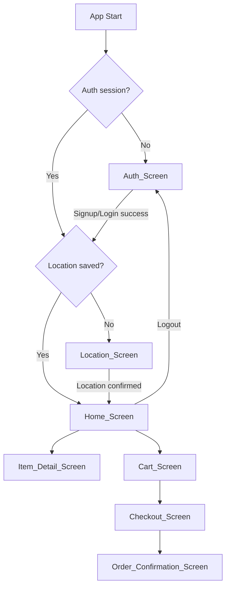

# Design Document: Grocery Delivery App

## Overview

A Flutter Android grocery delivery application backed by Firebase. Users authenticate with email/password, provide a delivery location (GPS or manual), browse grocery items by category, manage a cart, and complete purchases via UPI or Cash on Delivery. Orders are persisted to Firestore.

The app is a single-user, session-scoped experience: cart state lives in memory (via a Provider/Riverpod notifier) and is cleared on logout. Firebase Auth handles session persistence across cold starts.

### Key Design Decisions

- **Riverpod** is chosen over Provider for state management. It offers compile-safe providers, better testability (no BuildContext required for reads), and cleaner separation between UI and business logic.
- **Cart is in-memory** (a `StateNotifier` / `Notifier`) — no Firestore sync until order placement. This keeps the cart fast and avoids unnecessary writes.
- **Navigation** uses Flutter's `Navigator 2.0` via `go_router` for declarative, URL-like routing with redirect guards (auth check, location check).
- **UPI payment** uses the `upi_india` package, which launches installed UPI apps via Android intent and returns a transaction response.
- **Geolocator** handles GPS permission and coordinate resolution; `geocoding` package converts coordinates to a human-readable address.

---

## Architecture

The app follows a layered architecture:

```
UI Layer (Screens / Widgets)
        ↕
State Layer (Riverpod Providers / Notifiers)
        ↕
Service Layer (AuthService, LocationService, ProductService, OrderService, PaymentService)
        ↕
External (Firebase Auth, Firestore, Geolocator, UPI India)
```

### Navigation Flow



### Screen Navigation Stack

`go_router` manages routes with two redirect guards:
1. **Auth guard**: if no Firebase user → redirect to `/auth`
2. **Location guard**: if no location in session state → redirect to `/location`

Routes:
- `/auth` — Auth_Screen
- `/location` — Location_Screen
- `/home` — Home_Screen
- `/item/:id` — Item_Detail_Screen
- `/cart` — Cart_Screen
- `/checkout` — Checkout_Screen
- `/confirmation` — Order_Confirmation_Screen

---

## Components and Interfaces

### Services

#### AuthService
```dart
abstract class AuthService {
  Stream<User?> get authStateChanges;
  Future<void> signUp(String email, String password);
  Future<void> signIn(String email, String password);
  Future<void> signOut();
  User? get currentUser;
}
```

#### LocationService
```dart
abstract class LocationService {
  Future<String> getCurrentAddress(); // GPS → geocoded address
  Future<bool> requestPermission();
}
```

#### ProductService
```dart
abstract class ProductService {
  Future<List<Category>> getCategories();
  Future<List<Item>> getItems({String? categoryId});
  Future<Item> getItemById(String id);
}
```

#### OrderService
```dart
abstract class OrderService {
  Future<String> placeOrder(OrderRequest request); // returns orderId
}
```

#### PaymentService
```dart
abstract class PaymentService {
  Future<UpiResponse> initiateUpiPayment({
    required String amount,
    required String orderId,
  });
}
```

### Riverpod Providers

| Provider | Type | Purpose |
|---|---|---|
| `authServiceProvider` | `Provider<AuthService>` | Firebase Auth wrapper |
| `authStateProvider` | `StreamProvider<User?>` | Live auth state |
| `locationProvider` | `StateNotifierProvider<LocationNotifier, LocationState>` | Session delivery location |
| `productServiceProvider` | `Provider<ProductService>` | Firestore product reads |
| `categoriesProvider` | `FutureProvider<List<Category>>` | All categories |
| `itemsProvider(categoryId?)` | `FutureProvider<List<Item>>` | Items, optionally filtered |
| `cartProvider` | `StateNotifierProvider<CartNotifier, CartState>` | In-memory cart |
| `orderServiceProvider` | `Provider<OrderService>` | Firestore order writes |

### CartNotifier Interface
```dart
class CartNotifier extends StateNotifier<CartState> {
  void addItem(Item item);
  void incrementItem(String itemId);
  void decrementItem(String itemId); // removes if qty reaches 0
  void clearCart();
  int quantityOf(String itemId);
}
```

---

## Data Models

### Firestore Collections

#### `categories` collection
```
categories/{categoryId}
  name: String
  imageUrl: String
  sortOrder: int
```

#### `products` collection
```
products/{productId}
  name: String
  description: String
  imageUrl: String
  price: double
  categoryId: String  // ref to categories/{categoryId}
  inStock: bool
```

#### `orders` collection
```
orders/{orderId}
  userId: String
  deliveryLocation: String
  items: List<OrderItem>
    - productId: String
    - name: String
    - unitPrice: double
    - quantity: int
    - lineTotal: double
  totalAmount: double
  paymentMethod: String  // "UPI" | "COD"
  status: String         // "confirmed"
  createdAt: Timestamp
```

### Dart Models

```dart
class Category {
  final String id;
  final String name;
  final String imageUrl;
  final int sortOrder;
}

class Item {
  final String id;
  final String name;
  final String description;
  final String imageUrl;
  final double price;
  final String categoryId;
  final bool inStock;
}

class CartItem {
  final Item item;
  final int quantity;
  double get lineTotal => item.price * quantity;
}

class CartState {
  final List<CartItem> items;
  double get total => items.fold(0, (sum, ci) => sum + ci.lineTotal);
  bool get isEmpty => items.isEmpty;
}

class LocationState {
  final String? address;
  final bool isLoading;
  final String? error;
}

class OrderRequest {
  final String userId;
  final String deliveryLocation;
  final List<CartItem> items;
  final double totalAmount;
  final String paymentMethod; // "UPI" | "COD"
}
```

---

## Correctness Properties

*A property is a characteristic or behavior that should hold true across all valid executions of a system — essentially, a formal statement about what the system should do. Properties serve as the bridge between human-readable specifications and machine-verifiable correctness guarantees.*

